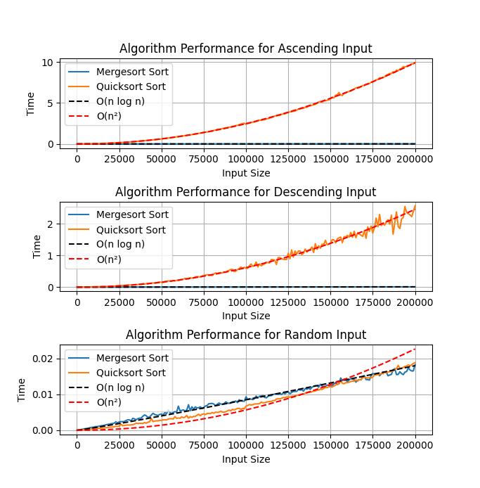

# Seminário de Análise de Algoritmos (DCC606 - 2024)

## Integrantes

- Eduardo Henrique Freire Machado (2020001617);
- Natália Ribeiro de Almada (2017009364).

## Introdução

A [apresentação](./AAQuicksortPresentation/AAQuickSort.pdf) do nosso grupo contempla o seguintes tópicos acerca do algoritmo `Quicksort`:

- [Função de custo e complexidade](./AAQuicksortPresentation/QuickSort.pdf);
- [Código da implementação em C](./quicksort.c);
- Experimentação da execução do algoritmo com diferentes entradas;
    - [Entradas utilizadas](./inputs/);
    - [Algoritmo de benchmark](./benchmark.py);
- [Gráfico de linha com o tempo de execução do algoritmo e análise da tendência de comportamento assintótico](#resultados);
    - [Algoritmo de plot do gráfico](./plot.py);
- Apresentação de algoritmo mais eficiente em termos de complexidade (`Mergesort`, nos piores casos do `Quicksort`);
    - [Função de custo e complexidade](./AAQuicksortPresentation/MergeSort.pdf);
    - [Código da implementação em C](./mergesort.c);
    - [Gráfico de linha com o tempo de execução do algoritmo e análise da tendência de comportamento assintótico](#resultados).
- [Vídeo de visualização dos algoritmos](./AAQuicksortPresentation/MergesortVSquicksort.mp4);

## Cálculos de Custo e Complexidade

- [Quicksort](./AAQuicksortPresentation/QuickSort.pdf);
    - Melhor Caso: $T(n) = ({\log_2 n} + 1)\cdot{n}$;
    - Caso Médio: $T(n) = ({\log_2 n} + 1)\cdot{n}$;
    - Pior Caso: $T(n) = \dfrac{n\cdot(n + 1)}{2}$;
- [Mergesort](./AAQuicksortPresentation/MergeSort.pdf);
    - Melhor Caso: $T(n) = ({\log_2 n} + 1)\cdot{O(n)}$;
    - Caso Médio: $T(n) = ({\log_2 n} + 1)\cdot{O(n)}$;
    - Pior Caso: $T(n) = ({\log_2 n} + 1)\cdot{O(n)}$.

## Resultados

Conseguimos observar que ao passo que o `Quicksort` possui uma complexidade de $`O(n^2)`$ para seus piores casos (vetores ordenados de forma crescente ou decrescente) e de $`O(n\cdot{\log_2 n})`$ para seu caso médio, o `Mergesort` se mantém numa complexidade de $`O(n\cdot{\log_2 n})`$ em todos os casos.

## Comparação Visual dos Algoritmos

Assista [esse vídeo](./AAQuicksortPresentation/MergesortVSquicksort.mp4).

## Objetivos

- [x] Função de Custo e Complexidade;
- [x] Código em C do algoritmo proposto;
- [x] Experimentação com a execução do algoritmo com diferentes entradas e coleta de tempo de execução;
- [x] Gráfico de linha com o tempo de execução em relação a cada entrada e análise da tendência de comportamento assintótico;
- [x] Apresentar um algoritmo que seja mais eficiente, em termos de complexidade, do que o algoritmo analisado.

## Considerações

- Binários em C foram compilados usando o `gcc`, com as flags `Wall`, `Wextra` e `-O3`.

